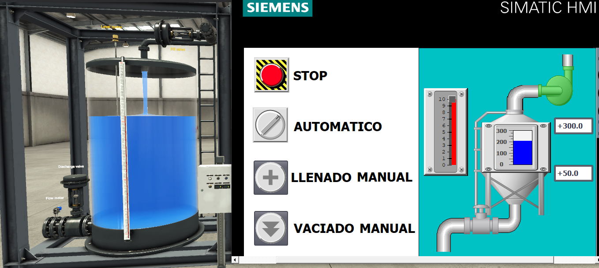

#  Sistema de Control de Nivel para Tanque

## 📋 Descripción
Control de Nivel de un Tanque de agua, para el llenado y vaciado automático/manual.

## 🎯 Objetivos del Proyecto
- Implementar lógica de control Ladder
- Gestionar modos de operación (Auto/Manual)
- Simular comportamiento 
- Crear interfaz HMI básica

## 🛠️ Tecnologías Utilizadas
- **PLC:** Siemens S7-1200 (simulado)
- **Software:** TIA Portal V18
- **Simulación:** S7-PLCSIM + Factory I/O
- **Lenguaje:** LAD (Ladder)

