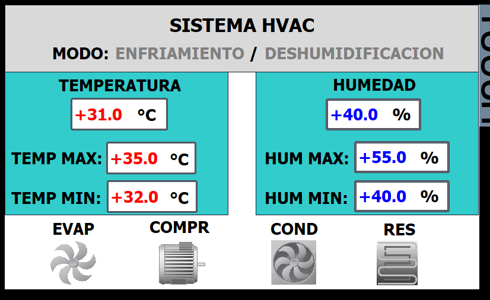

# Sistema de Control de Temperatura y Humedad

## 📋 Descripción  
Sistema de control automático para regular la temperatura y humedad de un ambiente mediante un evaporador, compresor, condensador y resistencia eléctrica.
Incluye una interfaz HMI para supervisión y ajuste de parámetros.

## 🎯 Objetivos del Proyecto
- Implementar lógica de control estructurada en bloques (FB/DB).
- Simular sensores analógicos de temperatura y humedad.
- Gestionar el funcionamiento del evaporador, compresor, condensador y resistencia.
- Crear una interfaz HMI para monitoreo y ajuste de setpoints.

## 🛠️ Tecnologías Utilizadas
- **PLC:** Siemens S7‑1200 (simulado)
- **Software:** TIA Portal V18
- **Simulación:** S7‑PLCSIM
- **Lenguaje:** FBD + SCL

