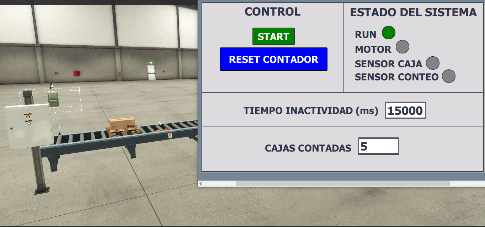

# Sistema de Control de Temperatura y Humedad

## 📋 Descripción  
Sistema de control para cinta transportadora con sensor para detectar objetos y llevar un conteo. Cuenta con un
temporizador de inactividad para detener la cinta y un HMI para monitoreo y ajuste del temporizador.

## 🎯 Objetivos del Proyecto
- Implementar lógica LADDER con contador y temporizador.
- Simular sensores de detección.
- Crear una interfaz HMI básica.

## 🛠️ Tecnologías Utilizadas
- **PLC:** Siemens S7‑1200 (simulado)
- **Software:** TIA Portal V18
- **Simulación:** S7‑PLCSIM
- **Lenguaje:** LAD

