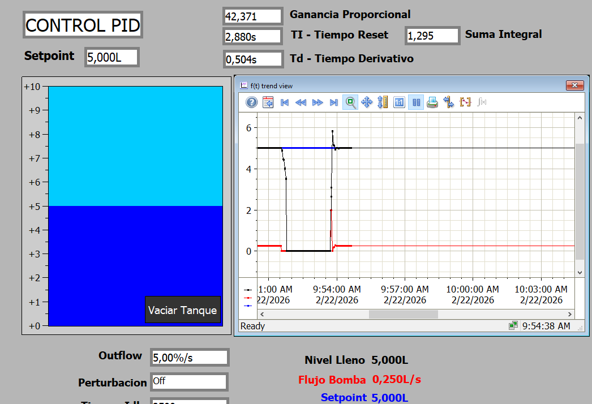
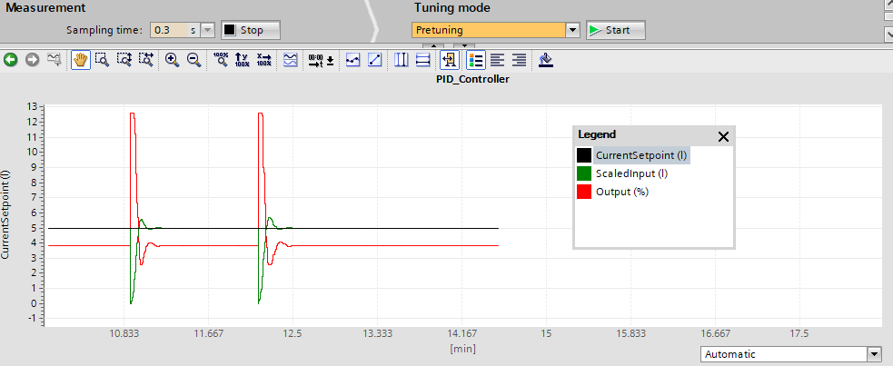

# Control PID Tanque

## 📋 Descripción  
Control PID para el llenado de un tanque. Implementación de gráfica para mostrar parámetros y modelo de tanque para simulación.

## 🎯 Objetivos del Proyecto
- Implementar control PID.
- Simular comportamiento.
- Interfaz HMI.

## 🛠️ Tecnologías Utilizadas
- **PLC:** Siemens S7‑1500 (simulado)
- **Software:** TIA Portal V18
- **Simulación:** S7‑PLCSIM
- **Lenguaje:** LAD

