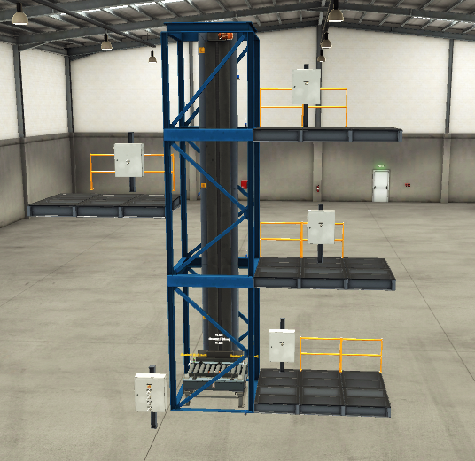

# Automatización Ascensor 

## 📋 Descripción  
Automatización de un ascensor simple de 4 pisos con PLC. Implementación de sensores para detectar los pisos, paro de emergencia y fin de carrera de seguridad para límite superior e inferior.

## 🎯 Objetivos del Proyecto
- Lógica secuencial
- Simulación con factory IO

## 🛠️ Tecnologías Utilizadas
- **PLC:** Siemens S7‑1200 (simulado)
- **Software:** TIA Portal V18
- **Simulación:** Factory IO
- **Lenguaje:** LAD

